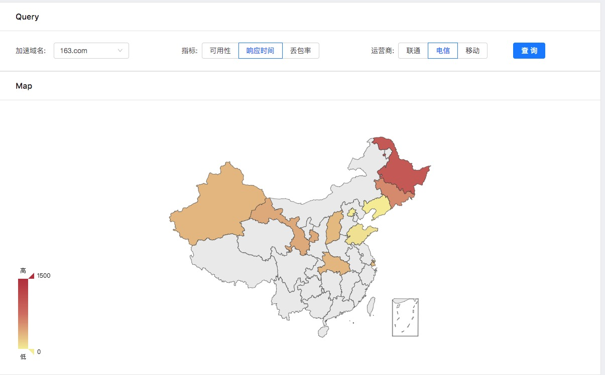
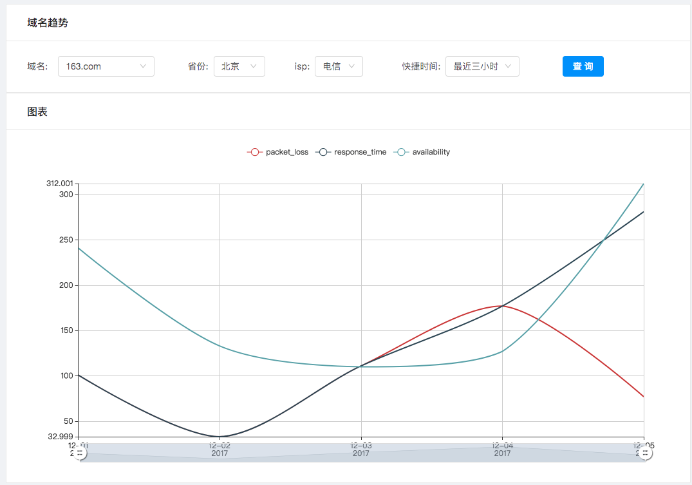

# react_monitor

使用react、antd开发的cdn节点质量的dashboard.

支持:

* 探测IP管理
* 域名管理
* 历史趋势
* 折线图
* 全国地图





### 如何跑起来？

1. 安装基础依赖

```
安装yarn
yum install yarn

安装nodejs
yum install nodejs
```

2. 安装组件

```
cd react_monitor
yarn install
```

3. 运行

```
cd react_monitor
yarn start
```

4. 启动mock接口

```
pip install flask
python mock_server.py
```

### 线上部署

安装并配置nginx, 加入cors配置.

```
add_header 'Access-Control-Allow-Origin' '*' always;
add_header 'Access-Control-Allow_Credentials' 'true';
add_header 'Access-Control-Allow-Headers' 'Authorization,Accept,Origin,DNT,X-CustomHeader,Keep-Alive,User-Agent,X-Requested-With,If-Modified-Since,Cache-Control,Content-Type,Content-Range,Range';
add_header 'Access-Control-Allow-Methods' 'GET,POST,OPTIONS,PUT,DELETE,PATCH';
```

js打包部署
```
cd react_monitor
yarn build
ll dist/
cp -r dist/  nginx目录下
```

